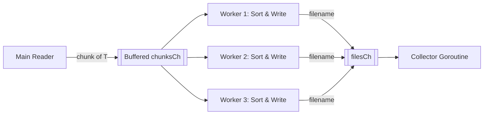
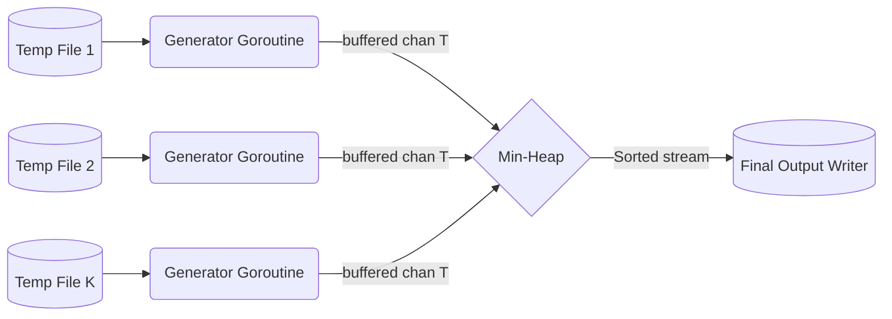

# BigSorter (Go)

A Go implementation of an external merge-sort library designed to sort extremely
large files that do not fit into RAM. It does this by splitting files into
smaller chunks, sorting them in memory, and merging them back together.

## Concurrency Architecture

To maximize throughput and minimize disk I/O bottlenecks, this library
implements standard Go concurrency patterns inspired by Rob Pike's "Go
Concurrency Patterns." The system decouples CPU-bound tasks (sorting) from
I/O-bound tasks (reading/writing disk) using channels and goroutines.

### The Pipeline Pattern

A pipeline is a series of stages connected by channels, where each stage is a
group of goroutines running the same function.

- **How it applies here**: In our current implementation (Phase 3), the split
  function reads a chunk, stops to sort it, stops to write it, and only then
  resumes reading. This leaves the CPU idle during I/O and the disk idle during
  CPU sorting.
- **The Plan**: We will create a 3-stage pipeline:
   1. **Stage 1 (Reader)**: Continuously reads records into an array until it
      hits `MaxItems`, then sends that array down a `chunksCh` channel.
   2. **Stage 2 (Sorter/Writer)**: Receives the array, sorts it, writes it to a
      temporary file, and sends the filename down a `filesCh` channel.
   3. **Stage 3 (Collector)**: Receives filenames and aggregates them into a
      slice to pass to the merge phase.

### Fan-Out (Worker Pools)

"Fan-out" occurs when multiple functions read from the same channel until that
channel is closed. It distributes work amongst a group of workers (a worker
pool) to parallelize CPU and I/O tasks.

- **How it applies here**: Sorting an array of 100,000 items is CPU intensive.
  Writing it to disk takes time. We don't want the Reader (Stage 1) to block
  while waiting for a single Sorter to finish.
- **The Plan**: We will fan-out Stage 2. We will spawn a pool of $N$ worker
  goroutines (e.g., matching `runtime.NumCPU()`). The Reader throws chunks into
  the `chunksCh`, and whichever worker is free picks it up, sorts it, writes it,
  and waits for the next chunk.

### Fan-In (Multiplexing)

"Fan-in" takes multiple input channels (or multiple workers sending to one
channel) and multiplexes them onto a single channel.

- **How it applies here**: Our Fan-out workers will all finish their
  sorting/writing at different times. They need to safely report the temporary
  filenames back to the main thread without race conditions.
- **The Plan**: All worker goroutines will send the resulting temporary
  filenames into a single shared `filesCh` (Fan-in). A separate collector
  goroutine ranges over this channel and safely builds the `tempFiles` slice
  without needing Mutex locks.

### The Generator Pattern (Pre-fetching)

Rob Pike describes a generator as a function that returns a channel, running a
goroutine in the background that yields values into that channel.

- **How it applies here (Merge Phase)**: In Phase 4, our heap pops the minimum
  item and immediately calls `reader.Read()` on the disk, blocking the heap
  until the disk responds.
- **The Plan**: We can wrap each of our $K$ temporary file readers in a
  Generator. Each file gets a dedicated background goroutine that reads records
  and pushes them into a buffered channel. When the heap needs the "next record"
  from file $X$, it simply reads from file $X$'s channel. This means disk I/O
  happens asynchronously in the background, keeping the heap working at maximum
  speed.

### Phase A: Split & Sort (Pipeline & Fan-Out/Fan-In)

During the split phase, the system uses a 3-stage pipeline with a worker pool to
achieve high throughput.



### Phase B: K-Way Merge (Generator & Pre-fetching)
During the merge phase, we use the Generator Pattern to prevent reading from 
disk synchronously that would block the Min-Heap. 



Note: *The current phase of this project contains the core generic interfaces (
`Reader`, `Writer`, `Serializer`, and `Comparator`) that form the foundation of
the library.*

## Prerequisites

* [Go](https://go.dev/dl/) 1.21 or later (required for Generics and
  `slices.SortFunc`).

## Getting Started

Clone the repository and navigate into the project directory:

```bash
git clone [https://github.com/stanimirivanov/bigsorter.git](https://github.com/stanimirivanov/bigsorter.git)
cd bigsorter
```

## Building the Project

Since bigsorter is a library, there is no executable binary to build. Instead,
you can compile the packages to ensure the code is error-free.

1. Clean up and verify dependencies:
   Ensure your `go.mod` file is up-to-date and all necessary dependencies are
   tracked:

    ```bash
    go mod tidy
    ```

2. Compile the library:
   Verify that the code compiles successfully across all packages:

    ```bash
    go build ./...
    ```

3. Format the code:
   Ensure the codebase adheres to standard Go formatting rules:

    ```bash
    go fmt ./...
    ```