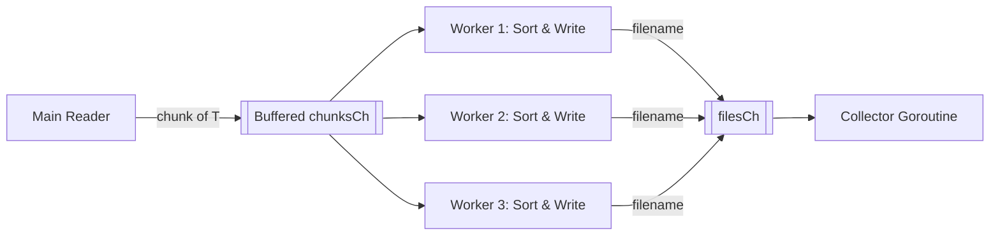
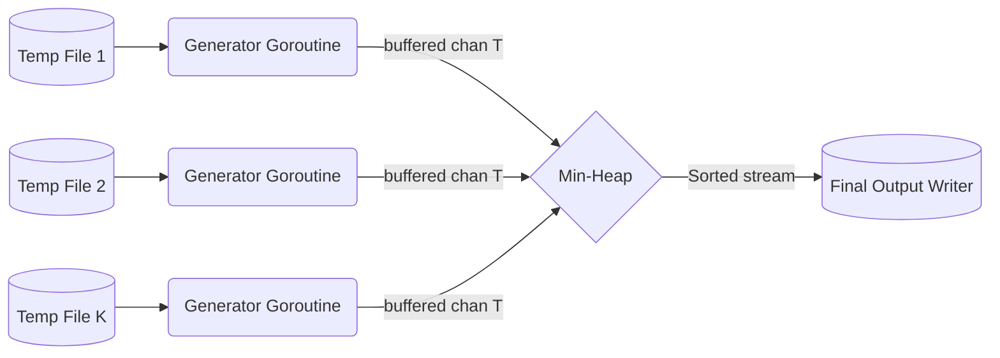

# BigSorter (Go)

A Go implementation of an external merge-sort library designed to sort extremely
large files that do not fit into RAM. It does this by splitting files into
smaller chunks, sorting them in memory, and merging them back together.

## Concurrency Architecture

To maximize throughput and minimize disk I/O bottlenecks, this library
implements standard Go concurrency patterns inspired by Rob Pike's "Go
Concurrency Patterns." The system decouples CPU-bound tasks (sorting) from
I/O-bound tasks (reading/writing disk) using channels and goroutines.

### The Pipeline Pattern

A pipeline is a series of stages connected by channels, where each stage is a
group of goroutines running the same function.

- **How it applies here**: In our current implementation (Phase 3), the split
  function reads a chunk, stops to sort it, stops to write it, and only then
  resumes reading. This leaves the CPU idle during I/O and the disk idle during
  CPU sorting.
- **The Plan**: We will create a 3-stage pipeline:
   1. **Stage 1 (Reader)**: Continuously reads records into an array until it
      hits `MaxItems`, then sends that array down a `chunksCh` channel.
   2. **Stage 2 (Sorter/Writer)**: Receives the array, sorts it, writes it to a
      temporary file, and sends the filename down a `filesCh` channel.
   3. **Stage 3 (Collector)**: Receives filenames and aggregates them into a
      slice to pass to the merge phase.

### Fan-Out (Worker Pools)

"Fan-out" occurs when multiple functions read from the same channel until that
channel is closed. It distributes work amongst a group of workers (a worker
pool) to parallelize CPU and I/O tasks.

- **How it applies here**: Sorting an array of 100,000 items is CPU intensive.
  Writing it to disk takes time. We don't want the Reader (Stage 1) to block
  while waiting for a single Sorter to finish.
- **The Plan**: We will fan-out Stage 2. We will spawn a pool of $N$ worker
  goroutines (e.g., matching `runtime.NumCPU()`). The Reader throws chunks into
  the `chunksCh`, and whichever worker is free picks it up, sorts it, writes it,
  and waits for the next chunk.

### Fan-In (Multiplexing)

"Fan-in" takes multiple input channels (or multiple workers sending to one
channel) and multiplexes them onto a single channel.

- **How it applies here**: Our Fan-out workers will all finish their
  sorting/writing at different times. They need to safely report the temporary
  filenames back to the main thread without race conditions.
- **The Plan**: All worker goroutines will send the resulting temporary
  filenames into a single shared `filesCh` (Fan-in). A separate collector
  goroutine ranges over this channel and safely builds the `tempFiles` slice
  without needing Mutex locks.

### The Generator Pattern (Pre-fetching)

Rob Pike describes a generator as a function that returns a channel, running a
goroutine in the background that yields values into that channel.

- **How it applies here (Merge Phase)**: In Phase 4, our heap pops the minimum
  item and immediately calls `reader.Read()` on the disk, blocking the heap
  until the disk responds.
- **The Plan**: We can wrap each of our $K$ temporary file readers in a
  Generator. Each file gets a dedicated background goroutine that reads records
  and pushes them into a buffered channel. When the heap needs the "next record"
  from file $X$, it simply reads from file $X$'s channel. This means disk I/O
  happens asynchronously in the background, keeping the heap working at maximum
  speed.

### Phase A: Split & Sort (Pipeline & Fan-Out/Fan-In)

During the split phase, the system uses a 3-stage pipeline with a worker pool to
achieve high throughput.



### Phase B: K-Way Merge (Generator & Pre-fetching)
During the merge phase, we use the Generator Pattern to prevent reading from 
disk synchronously that would block the Min-Heap. 



Note: *The current phase of this project contains the core generic interfaces (
`Reader`, `Writer`, `Serializer`, and `Comparator`) that form the foundation of
the library.*

## Prerequisites

* [Go](https://go.dev/dl/) 1.21 or later (required for Generics and
  `slices.SortFunc`).

## Getting Started

Clone the repository and navigate into the project directory:

```bash
git clone [https://github.com/stanimirivanov/bigsorter.git](https://github.com/stanimirivanov/bigsorter.git)
cd bigsorter
```

## Building the Project

Since bigsorter is a library, there is no executable binary to build. Instead,
you can compile the packages to ensure the code is error-free.

1. Clean up and verify dependencies:
   Ensure your `go.mod` file is up-to-date and all necessary dependencies are
   tracked:

    ```bash
    go mod tidy
    ```

2. Compile the library:
   Verify that the code compiles successfully across all packages:

    ```bash
    go build ./...
    ```

3. Format the code:
   Ensure the codebase adheres to standard Go formatting rules:

    ```bash
    go fmt ./...
    ```

## Testing

Run all unit and integration tests across all packages:

```bash
go test -v ./...
```

To run tests with Go's race detector enabled, `CGO` must be enabled and a C
compiler (like `gcc`) must be available on your system path:

```bash
# On macOS / Linux
CGO_ENABLED=1 go test -v -race ./...

# On Windows (PowerShell)
$env:CGO_ENABLED="1"; go test -v -race ./...

# On Windows (CMD)
set CGO_ENABLED=1 && go test -v -race ./...
```

**Note for Windows Users**: _The `-race` flag requires a C compiler. You can
easily install `gcc` via Chocolatey by running `choco install mingw -y` in an
administrative shell._

## 💡 Usage Examples

### 1. Simple Line-by-Line Text Sorting

Sort a massive text file alphabetically line-by-line:

```go
package main

import (
	"log"
	"os"
	"strings"

	"github.com/stanimirivanov/bigsorter"
	"github.com/stanimirivanov/bigsorter/lines"
)

func main() {
	input, err := os.Open("unsorted.txt")
	if err != nil {
		log.Fatal(err)
	}
	defer input.Close()

	output, err := os.Create("sorted.txt")
	if err != nil {
		log.Fatal(err)
	}
	defer output.Close()

	sorter := &bigsorter.Sorter[string]{
		Serializer: lines.Serializer{},
		Comparator: strings.Compare,
		MaxItems:   50_000, // Keep max 50,000 lines in RAM at once
	}

	if err := sorter.Sort(input, output); err != nil {
		log.Fatalf("sorting failed: %v", err)
	}
}
```
### 2. Sorting Gzipped Files (.gz)

Because `bigsorter.Sort()` accepts standard `io.Reader` and `io.Writer` 
interfaces, streaming compressed files requires zero extra configuration—just 
wrap your file streams with Go's standard `compress/gzip`:

```go
package main

import (
"compress/gzip"
"log"
"os"
"strings"

	"github.com/stanimirivanov/bigsorter"
	"github.com/stanimirivanov/bigsorter/lines"
)

func main() {
// Open compressed input
rawInput, _ := os.Open("huge_log.txt.gz")
defer rawInput.Close()
gzInput, _ := gzip.NewReader(rawInput)
defer gzInput.Close()

	// Create compressed output
	rawOutput, _ := os.Create("sorted_log.txt.gz")
	defer rawOutput.Close()
	gzOutput := gzip.NewWriter(rawOutput)
	defer gzOutput.Close()

	sorter := &bigsorter.Sorter[string]{
		Serializer: lines.Serializer{},
		Comparator: strings.Compare,
		MaxItems:   100_000,
	}

	// Decompresses on the fly -> Sorts -> Compresses on the fly
	if err := sorter.Sort(gzInput, gzOutput); err != nil {
		log.Fatal(err)
	}
}
```

### 3. Sorting Custom Structs / CSV Data
Sort complex custom data structures (e.g. Users by Age, then Name):

```go
package main

import (
	"cmp"
	"os"

	"github.com/stanimirivanov/bigsorter"
	"github.com/stanimirivanov/bigsorter/csv"
)

type User struct {
	ID   string `csv:"id"`
	Name string `csv:"name"`
	Age  int    `csv:"age"`
}

func main() {
	input, _ := os.Open("users.csv")
	defer input.Close()

	output, _ := os.Create("sorted_users.csv")
	defer output.Close()

	// Sort by Age (ascending), then by Name alphabetically
	userComparator := func(a, b User) int {
		if c := cmp.Compare(a.Age, b.Age); c != 0 {
			return c
		}
		return cmp.Compare(a.Name, b.Name)
	}

	sorter := &bigsorter.Sorter[User]{
		Serializer: csv.NewSerializer[User](),
		Comparator: userComparator,
		MaxItems:   25_000,
	}

	_ = sorter.Sort(input, output)
}
```

### 4. Custom Serializer Implementation
If you have a proprietary binary format or custom protocol buffers, implement 
the `types.Serializer[T]` interface:

```go
type Serializer[T any] interface {
    CreateReader(r io.Reader) (Reader[T], error)
    CreateWriter(w io.Writer) (Writer[T], error)
}
```

## ⚡ Benchmarks & Performance

`bigsorter` is designed for high-throughput, memory-bounded external sorting.
Benchmarks were run on an Intel Core i5-6440HQ CPU @ 2.60GHz (4 cores) using
32-character random string records.

```bash
go test -bench=. -benchmem ./...
```

### Dataset Scaling

| Record Count | Input Size | Time per Op  | Throughput    | Memory / Op | Allocations |
|:-------------|:-----------|:-------------|:--------------|:------------|:------------|
| **10,000**   | ~330 KB    | **32.9 ms**  | 10.0 MB/s     | 1.4 MB      | 40k allocs  |
| **100,000**  | ~3.3 MB    | **94.6 ms**  | **34.8 MB/s** | 13.2 MB     | 400k allocs |
| **500,000**  | ~16.5 MB   | **573.6 ms** | 28.7 MB/s     | 64.8 MB     | 2.0M allocs |

> *Note: Timings include full disk I/O (reading from input file, writing
temporary chunk files, and streaming merged output to `io.Discard`).*

---

### Tuning `MaxItems` (Chunk Size)

`MaxItems` dictates how many records are held in memory before flushing a sorted
chunk to disk.

| `MaxItems` Setting | Time (100k records) | Throughput     | Impact                                                            |
|:-------------------|:--------------------|:---------------|:------------------------------------------------------------------|
| **1,000**          | 853.7 ms            | 3.87 MB/s      | Too small — excessive temporary files and disk I/O overhead.      |
| **10,000**         | 137.6 ms            | 23.97 MB/s     | Good base setting for constrained memory environments.            |
| **25,000**         | **94.6 ms**         | **34.88 MB/s** | 🏆 **Optimal balance** between CPU sorting and I/O efficiency.    |
| **50,000**         | 117.7 ms            | 28.04 MB/s     | Slight overhead due to larger $O(N \log N)$ slice sorting in RAM. |

---

### Key Takeaways & Recommendations

* **Optimal `MaxItems`:** For string/struct sorting, setting `MaxItems` between
  **25,000 and 100,000** yields the highest throughput (~35 MB/s).
* **Predictable Memory Footprint:** Memory usage scales linearly with
  `MaxItems`, keeping heap footprint low and predictable regardless of how large
  the input file is.
* **Low Allocation Overhead:** Averages ~4 allocations per record throughout the
  entire split, sort, and merge pipeline.